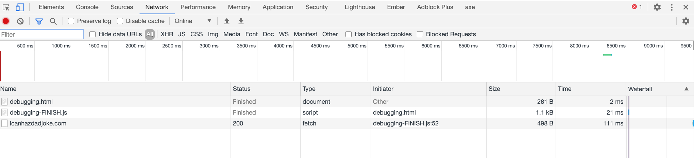

# Debugging

### Console Methods
```JavaScript
const people = [
  { name: 'Lenora', cool: true, country: 'United States' },
  { name: 'Ireland', cool: true, country: 'Ireland' },
  { name: 'Abeni', cool: false, country: 'Nigeria' },
];

function doctorize(name) {
 console.count(`Running doctorize for ${name}`);
 return `Dr. ${name}`;
}

function doAlotOfStuff() {
  console.groupCollapsed('Start doing things');
  console.warn('Warn me about things');
  console.error('Watch out for all errors');
  console.log('Done!');
  console.groupEnd();
}

console.info('See some info'); // Info mark
console.error('See an error'); // Red Error
console.warn('See a warning'); // Yellow warning
console.table(people); // Puts object in a table
console.count(); // Run the doctorize function and see how it maintains how many time a particular function was run.
console.group(); // Running a group of console methods
```


## Call Stack or Stack Tracing

If you want to know what went wrong in your code, you have to get good at reading the call stack.

What's a <strong>call stack</strong>? 

According to [MDN](https://developer.mozilla.org/en-US/docs/Glossary/Call_stack), a call stack is a mechanism for an interpreter (like the JavaScript interpreter in a web browser) to keep track of its place in a script that calls multiple functions — what function is currently being run and what functions are called from within that function, etc.

- When a script calls a function, the interpreter adds it to the call stack and then starts carrying out the function.
- Any functions that are called by that function are added to the call stack further up, and run where their calls are reached.
- When the current function is finished, the interpreter takes it off the stack and resumes execution where it left off in the last code listing.
- If the stack takes up more space than it had assigned to it, it results in a "stack overflow" error.

Example

```JavaScript
function greeting() {
   // [1] Some code here
   sayHi();
   // [2] Some code here
}
function sayHi() {
   return "Hi!";
}

// Invoke the `greeting` function
greeting();

// [3] Some code here
```

The code above would be executed like this:

1. Ignore all functions, until it reaches the greeting() function invocation.
2. Add the greeting() function to the call stack list.
```
Call stack list:
- greeting
```
3. Execute all lines of code inside the greeting() function.
4. Get to the sayHi() function invocation.
5. Add the sayHi() function to the call stack list.
```
Call stack list:
- sayHi
- greeting
```

6. Execute all lines of code inside the sayHi() function, until reaches its end.
7. Return execution to the line that invoked sayHi() and continue executing the rest of the greeting() function.
8. Delete the sayHi() function from our call stack list.
```
Call stack list:
- greeting
```

9. When everything inside the greeting() function has been executed, return to its invoking line to continue executing the rest of the JS code.
10. Delete the greeting() function from the call stack list.
```
Call stack list:
EMPTY
```

In summary, then, we start with an empty Call Stack. Whenever we invoke a function, it is automatically added to the Call Stack. Once the function has executed all of its code, it is automatically removed from the Call Stack. Ultimately, the Stack is empty again.


Okay, so what's a <strong>stack</strong> trace?

A stack trace is a report of the active stack frames at a certain point in time during the execution of a program.

In other words, the call stack is the actual data structure in memory, while the stack trace is a snapshot of said data structure.

Let's see this in action.

```JavaScript
function doctorize(name) {
  return `Dr. ${name}`;
}

function greet(name) {
  doesntExist(); // Cause an error
  return `Hello ${name}`;
}

function go() {
  const name = doctorize(greet('Wes'));
  console.log(name);
}
```


Let's read the stack trace above:

The error happened at `greet` in the file `debugging-FINISH.js` on line 32.

Well, who called `greet`?

Let's keep reading. `go` called `greet` in the file `debugging-FINISH.js` on line 37.

Then it says `<anonymous>:1:1`. What does that mean?

Just means I ran it from Google Dev Tools Console. However, if I run it in the code, the error would look like this.


## Grabbing Elements

You can open your Google Chrome Dev Tools, select the element in the elements tab, switch over to console, type `$0` and the console will return the element. You can then run `$0.value` or any other method against it to debug. `$0` is the last element clicked.


## Adding in breakpoints

`debugger;` is one of the most popular breakpoints to help you pause JavaScript while it is running.


It starts out by telling you what the variables are equal to, on the right side it shows the call stack, the scope (local and global variables), and a few other things. 

You can click the play button and you'll see how it continues.

You can also click the step over to another function button to step through line by line.

You can also add breakpoints by clicking on the line.


## Network Request

The network tab can be extremely useful when finding out where your program went to fetch data or how long it took to fetch or load data.


## Break on attribute

